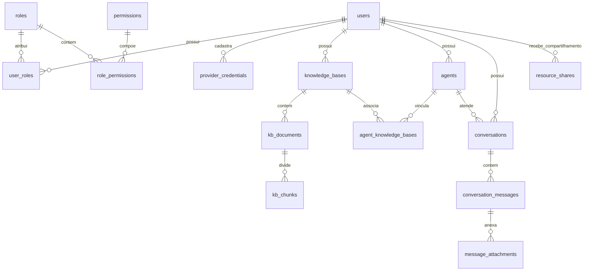

# Especificação Técnica e Arquitetural — Plataforma Wallet IA

**Data de Publicação:** 2026-09-01  
**Versão:** 1.0.0  
**Status:** Validado e Aprovado  
**Autores:** Equipe Advance Sistemas / Antigravity AI  

---

## 1. Visão Geral e Objetivos do Sistema

### 1.1 Objetivo
A **Plataforma Wallet IA** é uma solução self-hosted corporativa de orquestração de Inteligência Artificial Generativa e Recuperação Aumentada por Geração (RAG). O sistema entrega um ambiente completo, seguro e auditável com as seguintes capacidades centrais:

1. **Chat Interativo em Tempo Real:** Conversação com agentes de IA com streaming token a token (SSE/WebSocket), histórico paginado de mensagens e suporte a anexos de arquivos no chat.
2. **Agentes de IA Parametrizáveis:** Criação de agentes com *personas* customizadas (System Prompts especializados), controle fino de parâmetros (temperatura, limites de tokens) e conexão com múltiplos modelos.
3. **Bases de Conhecimento (RAG):** Ingestão, parsing, fragmentação (*chunking*) e indexação vetorial de documentos nos formatos `.md`, `.docx` e `.xlsx`, permitindo que agentes consultem dados proprietários com busca por similaridade semântica.
4. **Gateway de Múltiplos Provedores de IA:** Conexão nativa e unificada com **OpenRouter**, **OpenAI**, **Anthropic** e **Google Gemini**, com suporte a chaves privadas do usuário e chaves globais administradas.
5. **Segurança e Controle de Acesso Granular (RBAC):** Catálogo detalhado de permissões, papéis do sistema (`admin`, `user`), criação de papéis personalizados e distinção de privilégio raiz (`is_superadmin`).
6. **Matriz de Visibilidade e Compartilhamento:** Controle em três níveis (`private`, `shared`, `public`) para conversas, agentes e bases de conhecimento, com suporte a compartilhamento via *public slugs*.

---

## 2. Stack Tecnológica

| Camada | Tecnologia | Justificativa Técnica |
|---|---|---|
| **Linguagem Backend** | Python 3.12+ | Tipagem moderna, suporte maduro a chamadas assíncronas e ecossistema líder de IA. |
| **Gerenciador de Pacotes** | `uv` | Resolução e instalação de dependências ultrarrápida com locking determinístico (`uv.lock`). |
| **Framework API** | FastAPI + Uvicorn | Alto desempenho assíncrono nativo (ASGI), validação declarativa com Pydantic v2 e OpenAPI/Swagger automático. |
| **Persistência Relacional** | SQLAlchemy 2.0 (Async) + Alembic | ORM robusto com execução assíncrona (`asyncpg`/`aiosqlite`) e controle de migrações versionadas. |
| **Banco de Dados & Vetores** | PostgreSQL 16 + `pgvector` | Banco relacional unificado com indexação e busca por similaridade de cosseno em vetores de alta dimensão. |
| **Autenticação & Criptografia** | JWT (`python-jose`) + Passlib (`bcrypt`) | Autenticação stateless via Access + Refresh Tokens e hashing com salt dinâmico. |
| **Processamento de Documentos** | `markdown-it-py`, `python-docx`, `openpyxl` | Extração de conteúdo estruturado de arquivos Markdown, Word e Excel para o pipeline de RAG. |
| **Frontend SPA** | React 18/19, TypeScript, Vite, Tailwind CSS | Interface rica, tipada e de alta performance com temas Dark/Light e design responsivo. |
| **Testes Automatizados** | Pytest, Pytest-Asyncio, HTTPX / Vitest | Testes unitários e de integração de ponta a ponta para backend e frontend. |

---

## 3. Arquitetura de Software — Padrão em 3 Camadas

O backend adota o padrão **Domain-Driven Design (DDD)** estruturado em **3 Camadas Isoladas**, garantindo desacoplamento entre transporte HTTP, regras de negócio e operações de banco de dados.

```text
app/
├── core/                               # Núcleo compartilhado da aplicação
│   ├── config.py                       # Configurações globais (Settings via .env)
│   ├── database.py                     # Configuração de AsyncEngine e get_session
│   ├── base_model.py                   # DeclarativeBase central do SQLAlchemy
│   ├── security.py                     # Funções de hashing bcrypt e ciclo JWT
│   ├── permissions.py                  # Catálogo canônico de permissões (PermissionCode)
│   └── models.py                       # Registro unificado de todos os modelos ORM
│
└── domains/                            # Módulos verticais de negócio
    ├── auth/                           # Autenticação, sessão e refresh token
    ├── users/                          # Cadastro de usuários e administração
    ├── roles/                          # Gestão de papéis e matriz RBAC
    ├── providers/                      # Credenciais de IA (OpenRouter, OpenAI, Anthropic, Gemini)
    ├── knowledge_bases/                # Ingestão de arquivos, chunking e RAG
    ├── agents/                         # Configuração de agentes, personas e modelos
    └── conversations/                  # Chat, streaming SSE, anexos e compartilhamento
```

### 3.1 Responsabilidades de Cada Camada
1. **Camada de Diretiva (`directive.py`):**
   - Declaração de rotas HTTP com `APIRouter`.
   - Definição de esquemas Pydantic (`*Create`, `*Update`, `*Response`) com validação estrita.
   - Injeção de dependências: sessão de banco (`Depends(get_session)`), usuário autenticado (`Depends(get_current_user)`) e autorização RBAC (`Depends(require_permission(...))`).
   - Mapeamento e retorno de códigos de status HTTP padronizados (200, 201, 204, 400, 401, 403, 404).

2. **Camada de Orquestração (`orchestration.py`):**
   - Implementação de casos de uso e lógica de negócio pura.
   - Aplicação de regras de visibilidade e restrições de permissão.
   - Streaming assíncrono de tokens gerados por LLMs.
   - Algoritmos de chunking de texto e cálculo de busca vetorial por similaridade de cosseno.

3. **Camada de Execução (`execution.py`):**
   - Declaração de entidades SQLAlchemy (`Base`).
   - Configuração de tipos de colunas, restrições de unicidade, índices e chaves primárias UUID.
   - Mapeamento de relacionamentos ORM (`relationship`, `back_populates`, `cascade`).

---

## 4. Modelo de Dados e Esquema Relacional (DDL)



### 4.1 Descrição das Entidades

1. **`users`:**
   - `id` (UUID, PK), `email` (VARCHAR, Unique), `username` (VARCHAR, Unique), `password_hash` (TEXT), `full_name` (VARCHAR), `is_active` (BOOLEAN, default True), `is_superadmin` (BOOLEAN, default False), `created_at` (TIMESTAMP), `updated_at` (TIMESTAMP).

2. **`roles`:**
   - `id` (UUID, PK), `name` (VARCHAR, Unique), `description` (TEXT), `is_system` (BOOLEAN, default False), `created_by` (UUID, FK `users.id`), `created_at` (TIMESTAMP).

3. **`permissions`:**
   - `id` (UUID, PK), `code` (VARCHAR, Unique, ex: `users.manage`), `description` (TEXT).

4. **`role_permissions`:**
   - `role_id` (UUID, PK, FK `roles.id`), `permission_id` (UUID, PK, FK `permissions.id`).

5. **`user_roles`:**
   - `user_id` (UUID, PK, FK `users.id`), `role_id` (UUID, PK, FK `roles.id`).

6. **`provider_credentials`:**
   - `id` (UUID, PK), `owner_id` (UUID, FK `users.id`, Nullable para credenciais globais), `provider` (VARCHAR: `openrouter` | `openai` | `anthropic` | `gemini`), `api_key` (TEXT), `is_active` (BOOLEAN, default True), `created_at` (TIMESTAMP).

7. **`knowledge_bases`:**
   - `id` (UUID, PK), `owner_id` (UUID, FK `users.id`), `name` (VARCHAR), `description` (TEXT), `visibility` (VARCHAR: `private` | `shared` | `public`), `public_slug` (VARCHAR, Unique, Nullable), `created_at` (TIMESTAMP), `updated_at` (TIMESTAMP).

8. **`kb_documents`:**
   - `id` (UUID, PK), `knowledge_base_id` (UUID, FK `knowledge_bases.id`), `file_name` (VARCHAR), `file_type` (VARCHAR: `md` | `docx` | `xlsx`), `file_path` (TEXT), `status` (VARCHAR: `pending` | `processing` | `indexed` | `error`), `error_message` (TEXT, Nullable), `created_at` (TIMESTAMP).

9. **`kb_chunks`:**
   - `id` (UUID, PK), `document_id` (UUID, FK `kb_documents.id`), `content` (TEXT), `chunk_index` (INTEGER), `embedding` (VECTOR / JSONB), `metadata_json` (JSON / TEXT), `created_at` (TIMESTAMP).

10. **`agents`:**
    - `id` (UUID, PK), `owner_id` (UUID, FK `users.id`), `name` (VARCHAR), `description` (TEXT), `system_prompt` (TEXT), `provider` (VARCHAR), `model` (VARCHAR), `temperature` (FLOAT, default 0.7), `max_tokens` (INTEGER, Nullable), `visibility` (VARCHAR), `public_slug` (VARCHAR, Unique, Nullable), `created_at` (TIMESTAMP), `updated_at` (TIMESTAMP).

11. **`agent_knowledge_bases`:**
    - `agent_id` (UUID, PK, FK `agents.id`), `knowledge_base_id` (UUID, PK, FK `knowledge_bases.id`).

12. **`conversations`:**
    - `id` (UUID, PK), `owner_id` (UUID, FK `users.id`), `agent_id` (UUID, FK `agents.id`, Nullable), `title` (VARCHAR, Nullable), `visibility` (VARCHAR), `public_slug` (VARCHAR, Unique, Nullable), `created_at` (TIMESTAMP), `updated_at` (TIMESTAMP).

13. **`conversation_messages`:**
    - `id` (UUID, PK), `conversation_id` (UUID, FK `conversations.id`), `role` (VARCHAR: `user` | `assistant` | `system`), `content` (TEXT), `created_at` (TIMESTAMP).

14. **`message_attachments`:**
    - `id` (UUID, PK), `message_id` (UUID, FK `conversation_messages.id`), `file_name` (VARCHAR), `mime_type` (VARCHAR), `file_path` (TEXT), `size_bytes` (INTEGER, Nullable), `created_at` (TIMESTAMP).

15. **`resource_shares`:**
    - `id` (UUID, PK), `resource_type` (VARCHAR: `conversation` | `agent` | `knowledge_base`), `resource_id` (UUID), `shared_with_user_id` (UUID, FK `users.id`), `permission` (VARCHAR: `view` | `edit`), `created_at` (TIMESTAMP).

---

## 5. Segurança, Autenticação e Matriz de Permissões RBAC

### 5.1 Ciclo de Autenticação JWT
- **Access Token:** Tempo de vida curto (padrão: 60 minutos), `type: "access"`.
- **Refresh Token:** Tempo de vida longo (padrão: 7 dias), `type: "refresh"`.
- **Validação de Assinatura:** Algoritmo HS256 com chave secreta configurada em ambiente (`SECRET_KEY`).
- **Injeção de Dependência:** O middleware/dependência `get_current_user` valida o token Bearer e rejeita requisições com tokens revogados, expirados ou de usuários desativados (`is_active = False`).

### 5.2 Catálogo Canônico de Permissões (`PermissionCode`)
```python
class PermissionCode:
    USERS_MANAGE = "users.manage"
    ROLES_MANAGE = "roles.manage"
    CONVERSATIONS_CREATE = "conversations.create"
    CONVERSATIONS_VIEW_ALL = "conversations.view_all"
    AGENTS_CREATE = "agents.create"
    AGENTS_VIEW_ALL = "agents.view_all"
    KB_CREATE = "kb.create"
    KB_VIEW_ALL = "kb.view_all"
    PROVIDER_CREDENTIALS_MANAGE_OWN = "provider_credentials.manage_own"
    PROVIDER_CREDENTIALS_MANAGE_GLOBAL = "provider_credentials.manage_global"
```

### 5.3 Papéis Padrão do Sistema
1. **`admin` (`is_system = True`):** Possui todas as permissões do sistema. Não pode ser excluído.
2. **`user` (`is_system = True`):** Possui permissões operacionais padrão (`conversations.create`, `agents.create`, `kb.create`, `provider_credentials.manage_own`). Não pode ser excluído.
3. **Roles Customizadas:** Criadas dinamicamente via painel administrativo com combinação arbitrária de permissões.

### 5.4 Modelo de Visibilidade de Recursos
- **`private`:** Visível apenas para o proprietário (`owner_id`) e administradores com permissão `*.view_all` ou `is_superadmin`.
- **`shared`:** Visível e editável de acordo com os privilégios concedidos na tabela `resource_shares`.
- **`public`:** Leitura pública permitida sem cabeçalho de autenticação via rota pública com `public_slug`.

---

## 6. Mecanismo de IA, Pipeline RAG e Gateway de Provedores

### 6.1 Ingestão e Indexação RAG
1. **Suporte a Arquivos:**
   - **Markdown (`.md`):** Extração de texto preservando estrutura de seções.
   - **Microsoft Word (`.docx`):** Extração de texto de parágrafos e tabelas com `python-docx`.
   - **Microsoft Excel (`.xlsx`):** Extração linha a linha formatada com cabeçalhos de colunas via `openpyxl`.
2. **Segmentação (Chunking):**
   - Blocos de 500 a 1000 caracteres com sobreposição (*overlap*) de 100 caracteres para preservar a continuidade semântica entre limites de chunks.
3. **Busca Vetorial por Similaridade:**
   - Vetores de embedding calculados para cada chunk.
   - Consulta RAG: Ao receber uma mensagem do usuário em uma conversa atrelada a um Agente com bases associadas (`agent_knowledge_bases`), o sistema busca os Top-K chunks mais similares via distância de cosseno e injeta no System Prompt:
     ```text
     Contexto adicional da base de conhecimento:
     ---
     [Documento: manual.docx]
     Trecho relevante...
     ---
     Instruções do Sistema:
     <system_prompt do agente>
     ```

### 6.2 Gateway de Provedores
- **Provedores Integrados:** OpenRouter (gateway universal), OpenAI (GPT-4o, GPT-4o-mini), Anthropic (Claude 3.5 Sonnet) e Google Gemini (Gemini 1.5 Pro/Flash).
- **Hierarquia de Credenciais:** Busca prioritária pela chave privada do usuário autenticado; caso não cadastrada, recorre à chave global configurada pelo administrador.
- **Streaming de Resposta:** Respostas transmitidas via Server-Sent Events (SSE) no formato `data: {"token": "..."}\n\n` finalizando com `data: [DONE]\n\n`.

---

## 7. Catálogo de Endpoints da API REST e Streaming

```text
================================================================================
AUTENTICAÇÃO & PERFIL
================================================================================
POST   /auth/login                  # Autenticação de usuário e retorno dos tokens JWT
POST   /auth/refresh                # Renovação de access token via refresh token
POST   /auth/logout                 # Encerramento de sessão
GET    /auth/me                     # Perfil do usuário logado e lista de permissões

================================================================================
USUÁRIOS & ADMINISTRAÇÃO (Requer permissão users.manage)
================================================================================
POST   /users/                      # Registro inicial de usuário
GET    /admin/users                 # Listagem de todos os usuários do sistema
PUT    /admin/users/{user_id}       # Atualização de status, roles e dados do usuário

================================================================================
PAPÉIS & PERMISSÕES (Requer permissão roles.manage)
================================================================================
GET    /admin/permissions           # Catálogo de permissões disponíveis
GET    /admin/roles                 # Listagem de roles com suas permissões associadas
POST   /admin/roles                 # Criação de nova role personalizada
PUT    /admin/roles/{role_id}       # Atualização de role e permissões
DELETE /admin/roles/{role_id}       # Exclusão de role personalizada

================================================================================
CREDENCIAS DE PROVEDORES DE IA
================================================================================
GET    /provider-credentials/       # Lista credenciais disponíveis (próprias e globais)
POST   /provider-credentials/       # Cadastra nova credencial de provedor
DELETE /provider-credentials/{id}   # Remove credencial cadastrada

================================================================================
BASES DE CONHECIMENTO & RAG
================================================================================
GET    /knowledge-bases             # Lista bases de conhecimento acessíveis
POST   /knowledge-bases             # Cria nova base de conhecimento
GET    /knowledge-bases/{id}        # Detalhes da base e lista de documentos
POST   /knowledge-bases/{id}/docs   # Upload de arquivo (.md, .docx, .xlsx) e ingestão
DELETE /knowledge-bases/{id}        # Exclusão de base de conhecimento

================================================================================
AGENTES DE IA
================================================================================
GET    /agents                      # Lista agentes disponíveis para o usuário
POST   /agents                      # Criação de novo agente com persona e KBs
GET    /agents/{id}                 # Detalhes de um agente específico
PUT    /agents/{id}                 # Atualização de parâmetros, persona e KBs
DELETE /agents/{id}                 # Exclusão de agente

================================================================================
CONVERSAS & CHAT EM TEMPO REAL
================================================================================
GET    /conversations               # Histórico de conversas do usuário
POST   /conversations               # Criação de nova sessão de conversa
GET    /conversations/{id}          # Conversa ativa com histórico de mensagens
DELETE /conversations/{id}          # Exclusão de conversa
POST   /conversations/{id}/messages # Envio de prompt (+ anexo) com Streaming SSE
GET    /public/conversations/{slug} # Visualização pública anônima via slug

================================================================================
HEALTH CHECK
================================================================================
GET    /health                      # Verificação de status e integridade da API
```

---

## 8. Arquitetura da Interface de Usuário (Frontend SPA)

O frontend reside no diretório `frontend/` construído com React, TypeScript, Tailwind CSS e Vite:

```text
frontend/
├── index.html
├── package.json
├── tsconfig.json
├── vite.config.ts
├── tailwind.config.js
└── src/
    ├── components/
    │   ├── ui/                 # Botões, Inputs, Modais, Dropdowns, Badges, Toasts
    │   ├── layout/             # AppLayout, Sidebar colapsável, Header, UserMenu, ThemeToggle
    │   ├── chat/               # ChatView, MessageList, MessageItem, ChatInput, FileUploadArea
    │   ├── agents/             # AgentCard, AgentModal, PersonaEditor, ModelSelector
    │   ├── knowledge/          # KnowledgeBaseCard, DocumentUploader, VisibilityBadge
    │   └── admin/              # UserTable, RoleEditorModal, PermissionMatrix
    ├── contexts/
    │   ├── AuthContext.tsx     # Estado de autenticação, login, logout, refresh JWT
    │   └── ThemeContext.tsx    # Alternância Dark/Light com persistência local
    ├── hooks/
    │   ├── useAuth.ts          # Acesso ao usuário logado e verificação de permissões
    │   └── useChatStream.ts    # Gestão de ciclo de streaming SSE e acumulação de chunks
    ├── pages/
    │   ├── auth/ (LoginPage, RegisterPage)
    │   ├── chat/ (ChatPage)
    │   ├── agents/ (AgentsPage)
    │   ├── knowledge/ (KnowledgeBasesPage, KnowledgeBaseDetailPage)
    │   ├── providers/ (ProvidersPage)
    │   ├── admin/ (UsersAdminPage, RolesAdminPage)
    │   └── shared/ (SharedViewPage)
    └── services/
        ├── api.ts              # Cliente HTTP com injeção de Bearer Token e auto-refresh
        └── *.service.ts        # Métodos de chamada a cada domínio da API
```

### 8.1 Identidade Visual e UX
- **Tema Dark (Padrão):** Fundo `slate-950`, superfícies `slate-900`, bordas `slate-800`, destaques em gradiente Indigo/Violet (`#6366f1` a `#8b5cf6`).
- **Tema Light:** Fundo `slate-50`, superfícies brancas `#ffffff`, texto `slate-900`.
- **Renderização Markdown:** Suporte a blocos de código com destaque de sintaxe, tabelas e botão de cópia rápida.

---

## 9. Estratégia de Testes e Governança de Código

### 9.1 Padrões de Teste
- **Backend:** 
  - Testes executados obrigatoriamente com `uv run pytest`.
  - Cobertura de testes unitários para as camadas `directive`, `orchestration` e `execution`.
  - Testes de integração cobrindo fluxos completos de autenticação, RBAC, CRUDs e RAG.
- **Frontend:**
  - Testes de componentes com `vitest` e `@testing-library/react`.
  - Verificação estrita de tipos com `tsc --noEmit`.

### 9.2 Regras Globais de Desenvolvimento
1. Todo o código, comentários, logs e documentações devem estar em **Português do Brasil (pt-BR)**.
2. Uso mandatório de **`uv`** para gerenciamento de dependências e execução do ambiente Python.
3. Preservação estrita da separação em **3 Camadas** em qualquer nova adição ao backend.
